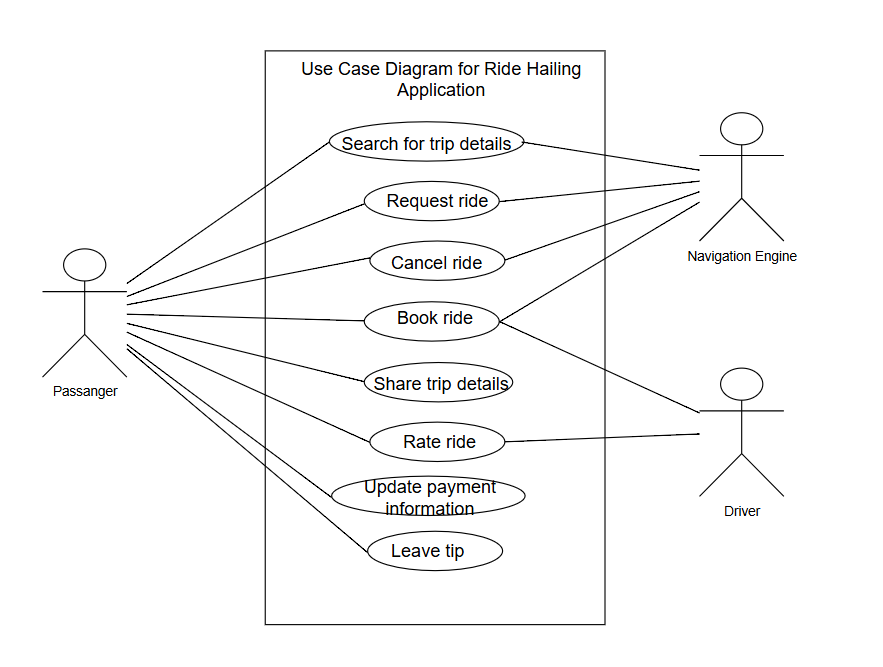

# Ride-Hailing Application UML Use Case Diagram

## System Description
This system represents a Ride-Hailing Application designed to connect passengers and drivers, enabling seamless ride requests and trip management. The system also includes administrators to oversee operations and resolve disputes. The use case diagram illustrates the interactions between actors and the system's functionalities.

## Actors
1. **Passenger**
   - Request a ride.
   - View ride history.
   - Make payments.
   
2. **Driver**
   - Accept ride requests.
   - View trip details.
   - Manage earnings.

3. **Administrator**
   - Manage users.
   - Oversee system operations.
   - Handle disputes.

## Use Cases
### Passenger
- **Request Ride**: Passengers select a pickup and drop-off location to book a ride.
- **View Ride History**: Passengers review their past trips.
- **Make Payment**: Passengers pay for completed rides using integrated payment methods.

### Driver
- **Accept Ride Request**: Drivers accept trip requests from passengers.
- **View Trip Details**: Drivers access trip information such as pickup/drop-off locations.
- **Manage Earnings**: Drivers track their earnings and payment summaries.

### Administrator
- **Manage Users**: Add, update, or deactivate user accounts (passengers and drivers).
- **Oversee System Operations**: Monitor ongoing trips and system performance.
- **Handle Disputes**: Resolve conflicts between passengers and drivers.

## Diagram
The UML Use Case Diagram for the Ride-Hailing Application is provided below:

## Repository Structure
